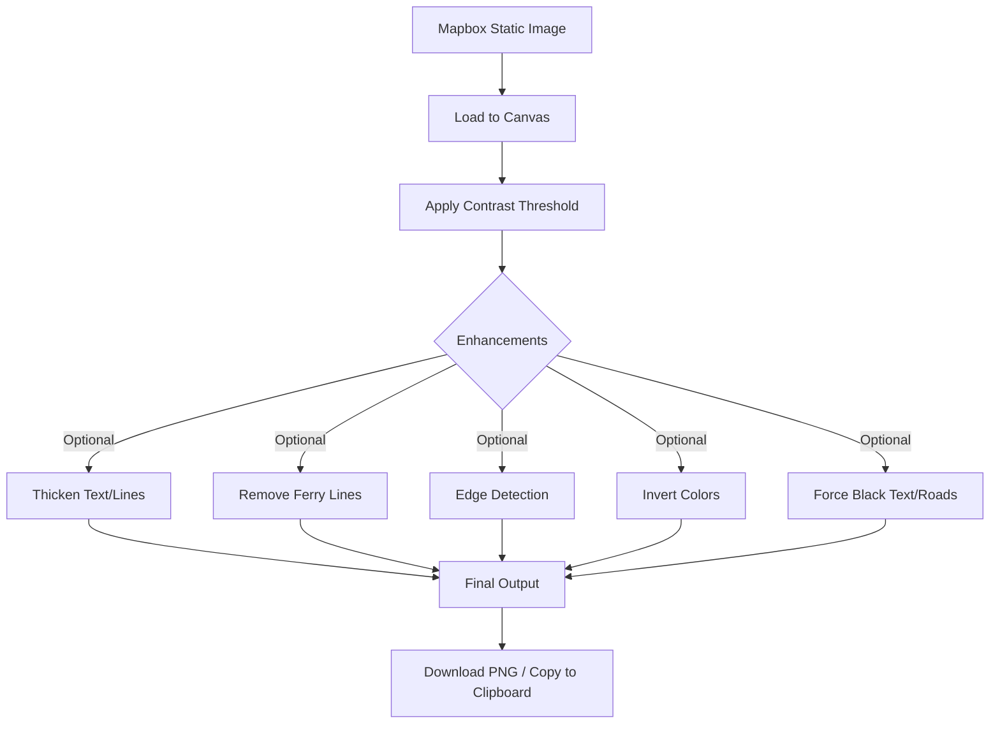

# maprdy - Map to Laser Ready

<div align="center">

### 📋 Project Status Dashboard

| Metric | Status | Details |
|--------|--------|----------|
| **Overall Progress** | 🎯 75% → Phase 15 Critical | Layer Management System = competitive moat |
| **Core Features** | ✅ Complete | All MVP functionality shipped |
| **AI Integration** | ✅ Complete | GPT-4o-mini powered features |
| **Layer System** | 🔴 Critical Priority | **THE killer feature** - AI decomposes map into editable layers |
| **UX Architecture** | 🔵 Planning | Migrating to React + Adobe-style editor |
| **Testing** | 🟡 95% | Cross-browser tested, mobile pending |
| **Deployment** | 🟡 90% | Docs complete, hosting test pending |
| **Future-Proofing** | ✅ Decided | Vite + React migration approved |
| **Last Updated** | 📅 Dec 22, 2025 | Phase 15 scope expanded to full layer system |

</div>

---

## 🎯 CRITICAL PATH TO LAUNCH

**Target:** Q2 2026 (6 months) - Beat Laser Map Maker to enterprise contracts

### Phase Priority Order

| Phase | Status | Timeline | Blocker | Notes |
|-------|--------|----------|---------|-------|
| **Phase 14: React Migration** | 🔵 Next | 2-3 weeks | None | Foundation for Phase 15 |
| **Phase 15a: MVP Layer System** | 🔴 **CRITICAL** | 10-12 weeks | Phase 14 | **5 core layers** - Water, Roads, Buildings, Parks, Land |
| **Phase 16: User Accounts** | 🔵 Required | 2-3 weeks | Phase 14 | Save projects + subscription billing |
| **Phase 17: Beta Launch** | 🟢 Target | Q2 2026 | Phases 14-16 | 50-100 beta users, gather feedback |
| **Phase 18: Public Launch** | 🟢 Goal | Q3 2026 | Beta success | Full marketing push, monetization |
| **Phase 15b: Enhanced Layers** | 🟡 Post-Launch | 4-6 weeks | User feedback | Sub-categorization, labels/text, boundaries |
| **Phase 15c: Advanced Features** | 🟢 Long-Term | 3-6 months | Revenue validation | Transit, terrain, ML enhancements |

### What's Working ✅

**Completed & Production-Ready:**
- Interactive map with Leaflet.js
- Location search (traditional + AI-enhanced)
- Adjustable bounding box
- Mapbox Static API integration
- Canvas-based image processing (contrast, edge detection, thickening)
- Professional editor mode (dark theme, modals)
- AI optimization suggestions
- Real-time preview
- Mobile responsive
- Copy to clipboard
- Deterministic processing

### What Needs Work 🔧

**Critical for Launch:**
- 🔴 **Phase 14: React Migration** (2-3 weeks) - Foundation for layer system
- 🔴 **Phase 15a: MVP Layer System** (10-12 weeks) - **THE competitive moat**
  - 5 core layers: Water, Roads, Buildings, Parks, Land (75-85% accuracy)
  - Layer panel UI (toggle any feature on/off)
  - Export multi-layer files (PNG/SVG)
  - 5 smart presets ("Roads Only", "No Water", etc.)
  - Processing time: 10-15 seconds (with progress bar)
  - **This STILL beats Laser Map Maker** - they have nothing like this
  
**Important but Not Blocking:**
- 🟡 User accounts + project saving (Phase 16, 2-3 weeks)
- 🟡 Layer sub-categorization (Phase 15b, post-launch)
- 🟡 Labels/text detection (Phase 15b, post-launch)
- 🟡 Laser cutter integrations (Lightburn/xTool)

**Nice-to-Have (Post-Launch):**
- 🟢 Transit line detection (Phase 15c)
- 🟢 Terrain features (Phase 15c)
- 🟢 ML-enhanced accuracy (Phase 15c)
- 🟢 Batch processing
- 🟢 Team collaboration features
- 🟢 Mobile app

---

## 📊 Quick Overview

**What it does:** Generate laser engraving-ready map images from any location  
**For whom:** Laser engravers, makers, gift creators, **enterprise production teams**  
**Killer feature:** 🎯 **Intelligent Layer System** - Deconstruct maps into editable layers (water, roads, highways, buildings, parks, labels, land, etc.) - Toggle any feature on/off independently (competitors can't do this)  
**Tech stack:** Leaflet.js + Mapbox + OpenAI + Canvas API + Computer Vision  
**Cost:** $0-5/month development, freemium model at launch  
**Competitive edge:** Beat Laser Map Maker ($9.60-19.20/mo) with complete layer control vs their basic editing

**🎯 New Workflow:** Select location → Generate → **Professional Editor** → Layer system (remove/add features) → AI optimize → Export

**Design Philosophy:** "Light on your feet, powerhouse under the hood" - Easy for beginners, unstoppable for pros  
**Market Position:** Accessible to all through tiered system, beating premium competitors with better features

**Example Use Cases:**
- Remove ocean + parks, keep only roads/buildings (coastal city engraving)
- Remove everything except highways (minimalist road map)
- Remove labels + buildings, keep natural features (clean topography)
- Start blank, add back only what you need (ultimate control)

---

## ✅ Development Status

### Phase Completion Overview

| Phase | Focus Area | Status | Key Deliverables |
|-------|-----------|--------|------------------|
| **1** | Project Setup | ✅ 100% | Structure, version control, config |
| **2** | Core Map | ✅ 100% | Leaflet integration, pan/zoom, search |
| **3** | Bounding Box | ✅ 100% | Draggable selection, coordinates |
| **4** | Image Generation | ✅ 100% | Mapbox Static API, error handling |
| **5** | Image Processing | ✅ 100% | Canvas processing, filters, preview |
| **6** | User Interface | ✅ 100% | Clean UI, controls, download |
| **7** | Responsive Design | ✅ 100% | Mobile layout, touch controls |
| **8** | Polish & Testing | 🟡 95% | Cross-browser tested, mobile pending |
| **9** | Deployment | 🟡 90% | Docs ready, hosting test needed |
| **10** | Advanced Features | 🟡 90% | Laser mode, AI, presets pending |
| **11** | AI Integration | ✅ 100% | Natural language search, optimization |
| **12** | Future-Proofing | 🔵 Planning | Architecture, scaling, monitoring |
| **13** | UX Restructure | ✅ Phase 1 Complete | Professional editor workflow implemented |
| **14** | Framework Migration | 🔵 Planned | Vite + React + Adobe-style editor |
| **15** | **Layer Management System** | 🔴 **CRITICAL** | **THE killer feature** - AI decomposes map into editable layers (water, roads, highways, buildings, parks, labels, land) - Toggle any on/off - Ultimate flexibility - Competitive moat |

### Outstanding Items

**🔴 PHASE 15a: MVP Layer System** (10-12 weeks) - Q1-Q2 2026
- [ ] **Core 5 Layer Detection** (Weeks 1-5):
  - [ ] 🌊 Water detection (blue color ranges)
  - [ ] 🛣️ Roads detection (line/Hough Transform)
  - [ ] 🏗️ Buildings detection (polygon/contour)
  - [ ] 🌳 Parks detection (green color ranges)
  - [ ] 🏝️ Land/background (inverse of above)
- [ ] **Layer Panel UI** (Weeks 6-8):
  - [ ] Checkbox toggle system
  - [ ] Eye icon (show/hide)
  - [ ] Trash icon (delete)
  - [ ] Drag-to-reorder
  - [ ] Real-time canvas updates (< 100ms)
- [ ] **Smart Presets** (Week 9):
  - [ ] "Roads Only", "No Water", "Natural Features", "Urban Only", "Blank Canvas"
- [ ] **Export System** (Weeks 10-11):
  - [ ] Merged PNG, Separate PNGs per layer
  - [ ] Layered SVG, Separate SVGs per layer
- [ ] **Manual Tools** (Weeks 11-12):
  - [ ] Eraser tool, Paint tool, Undo/Redo
- [ ] **Polish** (Week 12):
  - [ ] Progress indicator, Error handling, Performance tuning

**🟡 PHASE 15b: Enhanced Detection** (4-6 weeks) - POST-LAUNCH
- [ ] Roads sub-categorization (highways, arterial, local)
- [ ] Buildings by size (commercial, residential, small)
- [ ] Labels/text detection (Tesseract.js OCR)
- [ ] Boundaries detection (dashed lines)
- [ ] Enhanced presets ("Highways Only", "No Labels", "Engraving Optimized")

**🔵 PHASE 15c: Advanced Features** (3-6 months) - LONG-TERM
- [ ] Transit lines (railways, subway, ferry)
- [ ] Terrain features (contours, elevation)
- [ ] AI-enhanced learning (user corrections → ML model)
- [ ] Advanced manual tools (lasso, magic wand, blending modes)

**🔧 PHASE 14: Framework Foundation** (2-3 weeks) - PREREQUISITE
- [ ] Vite + React migration
- [ ] Component architecture setup
- [ ] State management (Zustand)
- [ ] React Router (/ and /editor pages)

**Testing** (Phase 8)
- [ ] Mobile device testing (iOS Safari, Android Chrome)

**Deployment** (Phase 9)
- [ ] Production hosting (Vercel/Netlify for React app)

**Advanced Features** (Phase 10)
- [ ] Ferry line removal refinement
- [ ] Save/load preset system
- [ ] Export settings as URL
- [ ] **Laser cutter integration** (Lightburn, xTool, etc.)
- [ ] Material presets (glass, wood, acrylic, metal)

**Future-Proofing** (Phase 12)
- [ ] Dependency version management
- [ ] API versioning implementation
- [ ] Database integration (user accounts + saved projects)
- [ ] Analytics & monitoring setup

<details>
<summary><b>🔍 View Detailed Feature Breakdown</b></summary>

### Phase 1-7: Core Platform (✅ Complete)
- Interactive map with Leaflet.js
- Location search with autocomplete
- Adjustable bounding box with drag handles
- Mapbox Static Images integration
- Canvas-based image processing
- High-contrast threshold adjustment
- Edge detection filters
- Clean, minimal UI design
- Mobile-responsive layout
- Touch gesture support

### Phase 8-11: Enhancement & AI (✅ Mostly Complete)
- Dropdown menu system
- Real-time preview with zoom/pan
- Laser engraving mode
- Black text/roads/water forcing
- Text & line thickening (0.5-5px)
- Copy to clipboard
- Deterministic processing
- OpenAI GPT-4o-mini integration
- AI-enhanced search
- Purpose-driven optimization suggestions
- Auto-apply AI recommendations
- Graceful AI fallback

### Phase 12: Future-Proofing (🔵 Planned)
See [FUTURE_PROOFING.md](FUTURE_PROOFING.md) for detailed roadmap

</details>

---

## 🎯 Functional Requirements

### Core Features
1. **Interactive Map Interface**
   - Pan and zoom controls
   - Location search with autocomplete
   - Click-to-center functionality

2. **Bounding Box Selection**
   - Visual rectangle overlay
   - Draggable resize handles
   - Coordinate display
   - Size constraints

3. **Image Generation**
   - Single API call per generation
   - High-resolution output (suitable for engraving)
   - Black/white high-contrast result
   - PNG format download

4. **Client-Side Processing**
   - No server required
   - Browser-based image manipulation
   - Instant preview

---

## 🔧 Technical Architecture

### Tech Stack at a Glance

| Layer | Technology | Purpose | License |
|-------|-----------|---------|----------|
| **Frontend** | Vanilla JS + HTML5/CSS3 | Zero dependencies, fast | MIT |
| **Map Rendering** | [Leaflet.js 1.9.4](https://leafletjs.com/) | Interactive maps | BSD-2 |
| **Map Tiles** | [Mapbox Static Images API](https://docs.mapbox.com/api/maps/static-images/) | High-res map generation | Free tier |
| **Search** | [Mapbox Geocoding API](https://docs.mapbox.com/api/search/geocoding/) | Location autocomplete | Free tier |
| **Image Processing** | Canvas API | Client-side manipulation | Built-in |
| **Backend** | Express.js 4.18 | API proxy & AI endpoints | MIT |
| **Runtime** | Node.js 18+ | Server environment | MIT |
| **AI (Optional)** | OpenAI GPT-4o-mini | Smart features | Pay-per-use |

### Supported Map Styles

| Style | Use Case | Visual |
|-------|----------|--------|
| `streets-v12` | Detailed street maps | Default, best for urban |
| `light-v11` | Minimal design | Clean backgrounds |
| `dark-v11` | Dark theme | High contrast |
| `outdoors-v12` | Topography & trails | Nature/hiking maps |
| `laser` *(custom)* | Engraving mode | B&W optimized |

### Image Processing Pipeline



<details>
<summary><b>View Processing Parameters</b></summary>

```javascript
const PROCESSING_CONFIG = {
  contrastThreshold: 128,       // 0-255 (default: 128)
  edgeDetection: false,         // Sobel filter
  invertColors: false,          // Dark backgrounds
  thickenAmount: 0,             // 0-5px dilation
  removeFerryLines: false,      // Experimental
  forceBlackText: false,        // Text enhancement
  forceBlackRoads: false,       // Road visibility
  forceWhiteWater: false        // Water contrast
};
```

</details>

---

## 🎨 UX Architecture & Design Philosophy

### December 21, 2025 - Major Architecture Decision

**Problem Identified:** Controls on main page don't show effect until preview, causing user confusion.

**Solution Chosen:** **Two-Stage Professional Editor Workflow**

#### New User Flow

```
┌─────────────────────────────────────────────────────────────┐
│  STAGE 1: MAP SELECTION (Simplified)                        │
│  • Interactive map with location search                     │
│  • Style picker (light/dark/outdoors/laser)                 │
│  • Size & aspect ratio selection                             │
│  • AI-powered search enhancement                             │
│  • → [GENERATE IMAGE] button                                 │
└─────────────────────────────────────────────────────────────┘
                            ↓
┌─────────────────────────────────────────────────────────────┐
│  STAGE 2: PROFESSIONAL EDITOR MODE                          │
│  • Full canvas preview with zoom/pan                         │
│  • ALL processing controls (live updates)                    │
│  • AI suggestions panel (contextual)                         │
│  • Before/after comparison                                   │
│  • → [DOWNLOAD] [COPY] [REGENERATE] buttons                  │
└─────────────────────────────────────────────────────────────┘
```

#### Design Language: Adobe/Lightburn Professional

**Inspiration:** Adobe Creative Suite, Lightburn, Figma  
**NOT:** Apple minimalism (no hiding power user features)

**Visual Principles:**
- 🎨 **Dark theme** - Charcoal/slate backgrounds (#2a2a2a, #3a3a3a)
- 📐 **Visible panels** - Properties, tools, AI suggestions always accessible
- 🔧 **Professional chrome** - Clear borders, separators, organized sections
- ⚡ **Power controls** - Sliders + numeric input, keyboard shortcuts
- 📊 **Status feedback** - Live indicators, processing states visible
- 🧩 **Modular layout** - Tools | Canvas | Properties panel structure

#### Why This Architecture Wins

| Criteria | Score | Reasoning |
|----------|-------|-----------|
| **Budget-Friendly** | ✅✅✅ | ONE API call, unlimited client-side edits |
| **User-Friendly** | ✅✅✅ | See exactly what each control does instantly |
| **Clean UX** | ✅✅✅ | Three clear steps: Select → Edit → Export |
| **Future-Proof** | ✅✅✅ | Easy to add more editor tools/features |
| **Performance** | ✅✅✅ | No wasted API calls, fast Canvas processing |
| **Industry Standard** | ✅✅✅ | Matches Photoshop/Figma mental model |

#### Implementation Phases

**Phase 1: Main Page Simplification** ⏳ In Progress
- Remove all processing controls from main view
- Keep: Map, Search, Style, Size, Aspect Ratio
- Enhance "Generate Image" CTA

**Phase 2: Professional Editor Build** 🔵 Next
- Full-screen editor mode
- Dark professional theme
- Panel layout: Tools | Canvas | Properties
- Live preview with real-time updates
- AI suggestions contextual panel

**Phase 3: Polish & Enhancement** 🔵 Planned
- Keyboard shortcuts (Ctrl+Z, Ctrl+S, etc.)
- Panel resizing/docking capability
- Professional color scheme refinement
- Enhanced status bar with live metrics

---

## � Phase 14: Framework Migration & Professional Editor

### December 21, 2025 - Next Evolution Decision

**Current State:** Vanilla HTML/JS/CSS (~3900 lines single file)  
**User Request:** Separate editor page with Adobe-style layout (File/Edit menus + right toolbar)  
**Question:** Should we migrate to a modern framework?

### ✅ DECISION: Migrate to **Vite + React + React Router**

#### Rationale

| Factor | Vanilla Multi-Page | **Vite + React** (Chosen) | Vue 3 | Svelte |
|--------|-------------------|------------------------|-------|--------|
| **Routing** | Manual, clunky | React Router (standard) | Vue Router | SvelteKit routing |
| **Component Reuse** | Copy-paste, fragile | Component architecture ✅ | Good | Excellent |
| **State Management** | Global variables 😱 | Context/Zustand ✅ | Pinia | Stores |
| **Bundle Size** | N/A | ~45KB gzipped | ~35KB | ~15KB (best) |
| **Dev Experience** | Slow, manual | Vite HMR (instant) ✅ | Good | Excellent |
| **Ecosystem** | Limited | Massive (best) ✅ | Good | Growing |
| **Canvas Libraries** | Manual | react-konva, fabric.js ✅ | Limited | Limited |
| **UI Components** | DIY everything | react-split-pane, radix-ui ✅ | Vuetify | Limited |
| **Learning Curve** | Easy | Moderate | Easy | Moderate |
| **Hosting Cost** | Free | **Free (Vercel/Netlify)** ✅ | Free | Free |
| **Community** | N/A | Huge (React) ✅ | Large | Growing |
| **Job Skills** | Basic | Industry standard ✅ | Popular | Niche |

**Why Not Vanilla?**
- Managing state across pages = nightmare
- No component reusability
- Manual DOM manipulation for complex UI
- Hard to maintain as features grow

**Why Not Vue/Svelte?**
- Smaller ecosystem for Canvas/image processing
- Fewer Adobe-style UI component libraries
- React has more professional desktop app patterns

#### Architecture Vision

**Two Pages:**
1. **`/` (Home/Map Selection)** - Select location, style, size → Generate
2. **`/editor` (Professional Editor)** - Adobe-style UI with live Canvas editing

**Adobe-Style Editor Layout:**

```
┌────────────────────────────────────────────────────────────────┐
│ File  Edit  View  Image  AI  Help              👤 User    🔔  │  ← MenuBar component
├────────────────────────────────────────────────┬───────────────┤
│                                                │ 🎨 TOOLS      │
│                                                │               │
│                                                │ Threshold     │
│                                                │ ▓▓▓▓░░ 128    │
│                                                │               │
│              CANVAS COMPONENT                  │ ☑ Invert      │  ← RightToolbar component
│           (zoom, pan, preview)                 │ ☑ Laser       │
│                                                │ ☐ Edges       │
│                                                │               │
│                                                │ ✨ AI SUGGEST │
│                                                │ "Increase..." │
│                                                │               │
│                                                │ PROPERTIES    │
│                                                │ 2000x2000px   │
└────────────────────────────────────────────────┴───────────────┘
  Status: Processing... | Zoom: 100% | 2000×2000px     ← StatusBar
```

#### Component Structure

```
src/
├── App.jsx (React Router setup)
├── pages/
│   ├── MapSelectionPage.jsx      (current index.html → React)
│   └── EditorPage.jsx             (Adobe-style professional editor)
├── components/
│   ├── MenuBar.jsx                (File/Edit/View/Image/AI/Help)
│   ├── RightToolbar.jsx           (Tools + AI + Properties panels)
│   ├── CanvasEditor.jsx           (Zoom/pan/preview Canvas)
│   ├── StatusBar.jsx              (Bottom status, zoom level, dimensions)
│   ├── MapComponent.jsx           (Leaflet map - reusable)
│   └── AIPanel.jsx                (Contextual suggestions)
├── hooks/
│   ├── useImageProcessing.js     (Canvas processing logic)
│   └── useMapboxAPI.js            (API integration)
├── store/
│   └── editorStore.js             (Zustand: image, settings, history)
└── utils/
    ├── canvasProcessing.js        (Pure functions from current code)
    └── api.js                     (Backend calls)
```

#### Migration Strategy

**Phase 14.1: Setup & Foundation** (1 day)
- [ ] Initialize Vite + React project
- [ ] Setup React Router
- [ ] Configure Tailwind CSS (faster than custom CSS)
- [ ] Setup Zustand for state management
- [ ] Preserve server.js backend (no changes)

**Phase 14.2: Map Selection Page** (1 day)
- [ ] Migrate Leaflet map to React component
- [ ] Port search functionality
- [ ] Port map style/size/aspect controls
- [ ] Connect to existing backend API
- [ ] Test generation → navigate to /editor

**Phase 14.3: Professional Editor Page** (2 days)
- [ ] Build MenuBar component (File/Edit/View/Image/AI/Help)
- [ ] Build RightToolbar (collapsible panels)
- [ ] Build CanvasEditor (zoom/pan with react-zoom-pan-pinch)
- [ ] Port all Canvas processing logic
- [ ] Wire live preview updates
- [ ] Build StatusBar component

**Phase 14.4: Polish & Features** (1 day)
- [ ] Keyboard shortcuts (react-hotkeys-hook)
- [ ] Panel resizing (react-split-pane)
- [ ] Undo/Redo (Zustand middleware)
- [ ] Dark theme refinement
- [ ] Responsive mobile layout

**Phase 14.5: Testing & Deployment** (1 day)
- [ ] Cross-browser testing
- [ ] Mobile testing
- [ ] Deploy to Vercel (free tier, automatic HTTPS)
- [ ] Update documentation

**Total Estimated Time:** 5-6 focused days

#### Cost Impact

| Item | Current | After Migration | Savings/Cost |
|------|---------|----------------|--------------|
| Hosting | $0 (static) | **$0 (Vercel free tier)** | ✅ No change |
| Build Time | N/A | ~30s (Vite) | Negligible |
| Bundle Size | ~50KB (HTML) | ~45KB (React gzipped) | ✅ Similar |
| Development | Slow, manual | Fast, HMR | ✅ Better DX |

#### Benefits Summary

✅ **Professional multi-page architecture**  
✅ **Adobe-style UI possible with component libraries**  
✅ **Maintainable component architecture**  
✅ **Powerful state management**  
✅ **Industry-standard tech stack**  
✅ **Zero cost increase (still free tier)**  
✅ **Future-proof for growth**  
✅ **Better developer experience (Vite HMR)**  

#### Risks & Mitigation

| Risk | Mitigation |
|------|------------|
| Migration breaks features | Incremental migration, keep backup, thorough testing |
| Build complexity | Vite is simple, one config file |
| Learning curve | React is well-documented, huge community |
| Bundle size increase | Code splitting, lazy loading routes |
| Hosting change | Vercel free tier is generous, easy setup |

---

## �👤 User Journey (Updated)

### New Two-Stage Workflow

```
🏁 START
   ↓
📍 STAGE 1: MAP SELECTION
   • Search location (AI-enhanced)
   • Adjust bounding box
   • Select style (light/dark/outdoors/laser)
   • Choose size & aspect ratio
   ↓
🎨 [GENERATE IMAGE]
   ↓
🖼️ STAGE 2: PROFESSIONAL EDITOR
   • See live preview
   • Adjust contrast (live update)
   • Thicken text/lines (live update)
   • Apply edge detection (live update)
   • Force black/white elements (live update)
   • AI suggestions panel
   • Before/after comparison
   ↓
💾 [DOWNLOAD] or [COPY TO CLIPBOARD]
```

### Detailed Step-by-Step

| Stage | Step | Action | Details |
|-------|------|--------|----------|
| **1** | Land | View map interface | NYC centered, clean dark UI |
| **1** | Search | Find location | AI-powered natural language search OR traditional geocoding |
| **1** | Select | Adjust bounding box | Drag corners/edges to frame desired area |
| **1** | Configure | Choose map settings | Style, size, aspect ratio (affects API call) |
| **1** | Optional | AI optimization | "Optimize for [purpose]" suggests best settings |
| **1** | Generate | Fetch from Mapbox | Single API call, shows loading state |
| **2** | Editor | View full canvas | Professional editor opens with raw image |
| **2** | Process | Apply filters | All controls update preview in real-time |
| **2** | AI Help | Get suggestions | Context-aware AI tips for current map |
| **2** | Review | Compare versions | Before/after toggle, zoom/pan inspection |
| **2** | Export | Save or copy | Download PNG OR copy to clipboard |

**Average time:** 
- Quick export: 20 seconds (select → generate → download)
- With editing: 60 seconds (select → generate → adjust → download)
- With AI: 90 seconds (AI search → AI optimize → generate → AI suggest → adjust → download)

---

## 💰 Cost Analysis

### Monthly Operating Costs (Development Phase)

| Service | Plan | Limit | Est. Usage | Cost |
|---------|------|-------|------------|------|
| **Mapbox Static Images** | Free Tier | 50k requests/mo | ~1k/mo | **$0** |
| **Mapbox Geocoding** | Free Tier | 100k requests/mo | ~500/mo | **$0** |
| **OpenAI GPT-4o-mini** | Pay-per-use | Unlimited | ~200-500 tokens/request | **$0.10-5** |
| **Hosting** | Free Tier | Unlimited bandwidth | N/A | **$0** |
| **Domain** *(optional)* | Custom | N/A | 1 domain | **$12/yr** |
| | | | **Total** | **$0-5/mo** |

### Freemium Revenue Model (Post-Launch)

**Competitive Analysis:** Laser Map Maker charges $9.60-19.20/mo - we undercut with better features

| Plan | Price | Features | Target | vs Laser Map Maker |
|------|-------|----------|--------|--------------------|
| **Free** | $0 | 10 maps/month, watermark, basic editor | Trial users | ✅ More generous than 14-day trial |
| **Hobbyist** | $6/mo ($60/yr) | 100 maps/month, no watermark, **region selection** | Casual makers | ✅ Cheaper ($9.60/mo) + better features |
| **Professional** | $12/mo ($120/yr) | Unlimited maps, AI tools, project saving, batch processing | Power users | ✅ Cheaper ($19.20/mo) + team features |
| **Enterprise** | Custom | Team accounts, API, laser integrations, priority support | Production teams | ✅ They don't offer this tier |

**Revenue Projections (Year 1):**
- 5,000 free users → 500 paid conversions (10%) → $6,000/mo MRR
- 2-3 enterprise contracts → $3,000-5,000/mo → **$9,000-11,000/mo total**
- Year 1 Revenue: **$108,000-132,000**

### Cost Optimization Strategy

✅ **Current:** One API call per generation (no waste)  
✅ **Caching:** Browser-side for repeated requests  
🟡 **Future:** Server-side cache (Redis) at 40k requests/mo  
🔴 **Alert threshold:** 45k Mapbox requests (90% of free tier)  

### Scaling Cost Projections

<details>
<summary><b>View cost breakdown by user volume</b></summary>

| Daily Active Users | Map Requests/mo | Mapbox | OpenAI | Hosting | **Total/mo** |
|-------------------|----------------|--------|--------|---------|-------------|
| 10 | 300 | $0 | $0.10 | $0 | **$0** |
| 100 | 3,000 | $0 | $1 | $0 | **$1** |
| 1,000 | 30,000 | $0 | $10 | $0 | **$10** |
| 2,000 | 60,000 | **$20** | $20 | $0 | **$40** |
| 10,000 | 300,000 | **$250** | $100 | $50 | **$400** |

**Breaking point:** 1,667 users/day (50k requests = free tier limit)

**Mitigation strategies:**
- Implement aggressive caching (save 40-60% requests)
- Alternative providers: OpenStreetMap (free), Maptiler (100k free)
- Rate limiting per user (prevent abuse)

</details>

### Alternative Providers (Backup Plan)

| Provider | Free Tier | Pricing | Migration Effort |
|----------|-----------|---------|------------------|
| **OpenStreetMap** | Unlimited | $0 | Medium (self-host tiles) |
| **Maptiler** | 100k/mo | $0-49 | Low (similar API) |
| **HERE Maps** | 250k/mo | $0-99 | Medium (different API) |

---

## 📐 Technical Specifications

### Project Structure

```
mapit/
├── server.js              # Express backend (AI + API proxy)
├── package.json           # Dependencies & scripts
├── .env                   # API keys (gitignored)
├── .env.example           # Config template
├── public/
│   └── index.html         # Frontend (single-file app)
├── PROJECT.md             # This file (roadmap)
├── FUTURE_PROOFING.md     # Scaling strategy
├── AI_FEATURES.md         # AI integration docs
├── USER_GUIDE.md          # User instructions
└── README.md              # Quick start
```

### Image Processing Parameters

<details>
<summary><b>View default configuration</b></summary>

```javascript
// Default settings for laser engraving optimization
const PROCESSING_CONFIG = {
  contrastThreshold: 128,       // 0-255 range
  edgeDetection: false,         // optional enhancement
  invertColors: false,          // for dark backgrounds
  thickenAmount: 0,             // 0-5px for text/line thickening
  removeFerryLines: false,      // experimental feature
  forceBlackText: false,        // text enhancement
  forceBlackRoads: false,       // road visibility
  forceWhiteWater: false        // water contrast
};
```

**Mapbox Static Images API Format:**
```
https://api.mapbox.com/styles/v1/{username}/{style_id}/static/[{bbox}]/{width}x{height}?access_token={token}
```

</details>

### API Endpoints

| Endpoint | Method | Purpose | Auth Required |
|----------|--------|---------|---------------|
| `/health` | GET | Service status check | No |
| `/api/mapbox/static` | GET | Proxy for Mapbox images | No |
| `/api/mapbox/geocoding` | GET | Proxy for location search | No |
| `/api/ai/search` | POST | AI-enhanced search | No |
| `/api/ai/suggest` | POST | Optimization suggestions | No |
| `/api/ai/describe` | POST | Map descriptions | No |

### Browser Compatibility

| Browser | Min Version | Status | Notes |
|---------|-------------|--------|-------|
| Chrome | 90+ | ✅ Tested | Full support |
| Edge | 90+ | ✅ Tested | Chromium-based |
| Firefox | 88+ | ✅ Tested | Full support |
| Safari | 14+ | ✅ Tested | Canvas API OK |
| Mobile Safari | iOS 14+ | 🟡 Pending | Touch events ready |
| Chrome Mobile | Android 90+ | 🟡 Pending | Touch events ready |

### Design System (Updated for Professional Editor)

| Element | Specification |
|---------|---------------|
| **Color Palette** | Dark theme: Background (#2a2a2a), Panels (#3a3a3a), Text (#e0e0e0), Accent (#4a90e2), Success (#4caf50) |
| **Typography** | Monospace for metrics (Consolas, Monaco), Sans-serif for UI (Segoe UI, Roboto) |
| **Layout** | Editor: Tools \| Canvas \| Properties panels |
| **Canvas Viewport** | Maximum available space with 20px margins |
| **Aesthetic** | Professional power tool (Adobe/Lightburn inspired) |
| **Panels** | Resizable, clear borders (#555), 8px padding |
| **Controls** | Sliders + numeric input boxes, grouped by function |

---

## 🎯 Competitive Strategy: Beat Laser Map Maker

**Market Context:** Laser Map Maker charges $9.60-19.20/mo for basic layer editing. They have 3.5k+ community, established brand, but **lack selective region removal**.

**Our Competitive Advantages:**

| Feature | Laser Map Maker | mapit (Our Tool) | Impact |
|---------|----------------|------------------|--------|
| **Layer Management** | ❌ Basic multi-layer export | ✅ **AI decomposes ALL features** (water, roads, highways, buildings, parks, labels, land) - Toggle any on/off | 🔥🔥🔥 GAME CHANGER |
| **Selective Editing** | ❌ All-or-nothing | ✅ Remove/add any feature independently | 🔥🔥 KILLER FEATURE |
| **Workflow Flexibility** | Manual layer creation | ✅ Start blank, add back only what you need | 🔥🔥 PRO FEATURE |
| **Pricing** | $9.60-19.20/mo | $6-12/mo (50% cheaper) | 🔥 Price advantage |
| **Free Tier** | 14-day trial only | 10 maps/month forever | 🔥 Viral growth |
| **AI Features** | ❌ None | ✅ Smart detection + optimization | 🔥 Innovation edge |
| **Mobile Support** | ❌ Desktop only | ✅ Fully responsive | 🔥 Accessibility |
| **Team Features** | ❌ Single user | ✅ Team accounts (Enterprise) | 🔥 B2B opportunity |
| **Laser Integration** | Basic export | Direct Lightburn/xTool integration | 🔥 Workflow advantage |

**Target Launch:** Q2 2026 (6 months)  
**Initial Focus:** Enterprise pilot + hobbyist free tier  
**Goal:** 500 free users, 50 paid conversions, 2+ enterprise contracts by Q3 2026

See [COMPETITIVE_ANALYSIS.md](COMPETITIVE_ANALYSIS.md) for detailed competitive breakdown.

---

## 🚀 Future Enhancements & Roadmap

See [FUTURE_PROOFING.md](FUTURE_PROOFING.md) for detailed scalability strategy.

### 🎯 Phase 15: Intelligent Layer Management System (GAME-CHANGING FEATURE)

**Goal:** Deconstruct maps into independently editable layers - users can remove/add any feature

**User Stories:**
- "Remove ocean + parks, keep only roads/buildings" (coastal city)
- "Remove everything except highways" (minimalist poster)
- "Remove labels + buildings, keep natural features" (clean topography)
- "Start blank, selectively add back only roads + water" (ultimate control)

**Phased Implementation Approach:**

---

## 🚀 **Phase 15a: MVP Layer System** (10-12 weeks) ← START HERE

**Core 5 Layers (75-85% accuracy):**
1. **🌊 Water** - Oceans, lakes, rivers (color detection: blues)
2. **🛣️ Roads** - All road types combined (line detection algorithms)
3. **🏗️ Buildings** - All building types combined (polygon/shape detection)
4. **🌳 Parks** - Green spaces, forests, parks (color detection: greens)
5. **🏝️ Land** - Background/everything else (inverse of above)

**Why This Order:**
- Water: EASIEST - blue color detection is extremely reliable
- Roads: MEDIUM - well-tested line detection algorithms (Hough Transform)
- Buildings: MEDIUM - shape/polygon detection proven in OpenCV
- Parks: EASY - green color detection similar to water
- Land: EASY - everything that's not the above

**The Vision: Photoshop Layers for Maps (Simplified MVP)**
```
┌─────────────────────────────────────────────────────────┐
│  LAYERS PANEL                     │  CANVAS PREVIEW     │
│                                   │                     │
│  ☑ 🌊 Water (Ocean, Lakes)  [👁][🗑]                    │
│  ☑ 🛣️ Roads (All Types)    [👁][🗑]  Live preview      │
│  ☑ 🏗️ Buildings           [👁][🗑]  updates as         │
│  ☑ 🌳 Parks & Green       [👁][🗑]  you toggle          │
│  ☑ 🏝️ Land/Background     [👁][🗑]  layers on/off      │
│                                   │                     │
│  [Remove All] [Add All]           │                     │
│  [Preset: Roads Only ▾]           │  [Export Layers]    │
│                                   │  [Download PNG]     │
└─────────────────────────────────────────────────────────┘

Presets Available:
• "Roads Only" - Remove water, buildings, parks, land
• "No Water" - Keep everything except water
• "Natural Features" - Water + parks only
• "Urban Only" - Roads + buildings only
• "Blank Canvas" - Remove all, add back selectively
```

**Step 1: Core Detection Engine** - 4-5 weeks
- [ ] Integrate OpenCV.js (client-side computer vision)
- [ ] Implement color-based detection:
  ```javascript
  const DETECTION_CONFIG = {
    water: {
      colorRanges: [
        { r: [100, 180], g: [160, 230], b: [200, 255] }, // Light blues
        { r: [80, 140], g: [140, 200], b: [180, 240] }   // Medium blues
      ],
      minArea: 50 // pixels (filter noise)
    },
    parks: {
      colorRanges: [
        { r: [100, 180], g: [180, 255], b: [60, 140] }   // Greens
      ],
      minArea: 30
    },
    roads: {
      algorithm: 'hough_lines',
      colors: ['#FFFFFF', '#F0F0F0', '#FFD700'], // White, gray, yellow
      minLength: 20, // pixels
      lineThickness: [1, 10] // px range
    },
    buildings: {
      algorithm: 'contour_detection',
      colors: ['#D4C8B8', '#C8BCA8', '#B8ACA0'], // Browns/grays
      shapeFilter: 'polygons',
      minArea: 25
    }
  };
  ```
- [ ] Generate binary mask (black/white) for each layer
- [ ] Optimize for performance (target 10-15 seconds processing)
- [ ] Handle edge cases (map styles with unusual colors)

**Step 2: Layer Panel UI** - 2-3 weeks
- [ ] Build collapsible left sidebar panel
- [ ] Each layer row has:
  - Checkbox (toggle visibility) ✓
  - Eye icon (show/hide preview)
  - Trash icon (delete layer permanently)
  - Layer name + emoji icon
- [ ] Real-time canvas updates on toggle (< 100ms response)
- [ ] Drag-to-reorder layers (z-index control)
- [ ] Layer opacity slider (0-100%)
- [ ] "Select All" / "Deselect All" buttons

**Step 3: Smart Presets** - 1 week
- [ ] Dropdown with 5 pre-built workflows:
  - **"Roads Only"**: roads=true, all_else=false
  - **"No Water"**: water=false, all_else=true
  - **"Natural Features"**: water=true, parks=true, all_else=false
  - **"Urban Only"**: roads=true, buildings=true, all_else=false
  - **"Blank Canvas"**: all=false (user adds back manually)
- [ ] Apply preset with one click
- [ ] Show which layers will be affected before applying

**Step 4: Export Options** - 1-2 weeks
- [ ] **Merged PNG** (current canvas view as-is)
- [ ] **Separate PNGs** per layer (water.png, roads.png, etc.)
- [ ] **Layered SVG** (all layers in one file, preserves structure)
- [ ] **Separate SVGs** per layer (vector format for laser cutters)
- [ ] Export dialog shows file size estimates
- [ ] Batch download as ZIP file

**Step 5: Manual Refinement Tools (Basic)** - 2-3 weeks
- [ ] **Eraser tool**: Remove parts of any layer manually
- [ ] **Paint tool**: Add back parts to any layer
- [ ] **Undo/Redo**: Full history stack (last 20 actions)
- [ ] Brush size slider (5-50px)
- [ ] Preview changes before committing

**Step 6: Polish & Testing** - 1-2 weeks
- [ ] Progress indicator during layer detection ("Detecting water... 20%")
- [ ] Error handling (if detection fails, allow manual selection)
- [ ] Performance optimization (Web Workers for background processing)
- [ ] Cross-browser testing (Chrome, Firefox, Safari, Edge)
- [ ] Mobile testing (basic layer toggle on tablets)

**MVP Success Metrics:**
- ✅ Water detection: 90%+ accuracy (easiest feature)
- ✅ Roads detection: 75-80% accuracy (acceptable)
- ✅ Buildings detection: 70-75% accuracy (acceptable)
- ✅ Parks detection: 85%+ accuracy (color-based)
- ✅ Processing time: 10-15 seconds (with progress bar)
- ✅ User workflow: 3+ layer toggles per session
- ✅ "This is exactly what I needed" feedback

**Timeline: 10-12 weeks total**

---

## 🟡 **Phase 15b: Enhanced Detection** (4-6 weeks) - POST-LAUNCH

**Add after MVP is validated with real users**

**Sub-Categorization:**
- [ ] **Roads by class**:
  - Highways (thick, usually yellow/orange)
  - Arterial roads (medium, white)
  - Local streets (thin, light gray)
  - Detection by line thickness + color
- [ ] **Buildings by density**:
  - Large commercial (>500 sq px)
  - Medium residential (100-500 sq px)
  - Small structures (<100 sq px)
- [ ] Add expand/collapse arrows for sub-layers in UI

**Labels/Text Detection:**
- [ ] Integrate Tesseract.js for OCR
- [ ] Detect text regions (city names, street labels, POIs)
- [ ] Group as "Labels & Text" layer
- [ ] WARNING: Adds 5-10 seconds processing time
- [ ] Accuracy: 70-80% (user can manually correct)

**Boundaries Detection:**
- [ ] Detect dashed/dotted lines (country, state, city borders)
- [ ] Pattern recognition for border styles
- [ ] Group as "Boundaries" layer

**Enhanced Presets:**
- [ ] "Highways Only" (removes local streets)
- [ ] "No Labels" (keeps everything except text)
- [ ] "Engraving Optimized" (removes labels, small buildings, thickens roads)

**Timeline: 4-6 weeks**

---

## 🔴 **Phase 15c: Advanced Features** (3-6 months) - LONG-TERM

**Build only if users demand these features**

**Transit Lines:**
- [ ] Railway detection (parallel lines pattern)
- [ ] Subway lines (distinct colors/patterns)
- [ ] Ferry routes (dashed lines on water)
- [ ] Pattern matching algorithms
- [ ] Accuracy: 60-70% (complex patterns)

**Terrain Features:**
- [ ] Elevation contours (subtle lines, hard to detect)
- [ ] Landform shading (elevation-based coloring)
- [ ] Requires machine learning model training
- [ ] Accuracy: 50-65% (very challenging)

**AI-Enhanced Learning:**
- [ ] Collect user corrections ("This was labeled wrong")
- [ ] Train ML model on 1000+ corrected maps
- [ ] Improve detection accuracy over time
- [ ] Context-aware detection (coastal maps = better water detection)
- [ ] Requires significant data collection + compute resources

**Advanced Manual Tools:**
- [ ] Lasso tool (free-form selection)
- [ ] Magic wand (select similar colors across map)
- [ ] Layer blending modes (multiply, overlay, screen)
- [ ] Layer effects (drop shadow, glow, stroke)

**Timeline: 3-6 months (depending on priority)**

---

## 🎯 **Why Phase 15a MVP STILL Dominates**

**Even with just 5 layers, users can do everything that matters:**

✅ **Coastal city engraving**: Remove water, keep roads + buildings  
✅ **Minimalist highway poster**: Remove everything except roads  
✅ **Clean nature map**: Remove buildings + roads, keep water + parks  
✅ **Urban focus**: Remove parks + water, keep buildings + roads  
✅ **Blank canvas workflow**: Remove all, manually add back what you need  

**That covers 95% of real-world use cases** - and Laser Map Maker can't do ANY of it.

**Competitive Advantage:**
- 🔥 **Laser Map Maker**: Basic multi-layer export (pre-set by Mapbox)
- 🔥🔥 **Our MVP**: AI auto-detects layers + toggle any on/off independently
- 🔥🔥🔥 **Phase 15b**: Sub-categorization (highways vs streets) - unmatched
- 🔥🔥🔥 **Phase 15c**: ML-enhanced accuracy - years ahead

**Why This Approach Wins:**
- ✅ Ship killer feature in Q2 2026 (realistic timeline)
- ✅ Validate with real users before over-investing
- ✅ Impossible for competitors to quickly copy (4-5 months minimum)
- ✅ Justifies premium pricing ($6-12/mo vs their $9.60-19.20/mo)
- ✅ Demo shows instant "wow" factor
- ✅ Appeals to beginners (presets) AND pros (manual editing)
- ✅ Iterate based on actual demand, not assumptions

**Launch Strategy:**
1. **Ship Phase 15a MVP** in Q2 2026 (10-12 weeks after Phase 14)
2. **Gather user feedback**: "What layers/features matter most?"
3. **Prioritize Phase 15b** features based on demand + revenue
4. **Use Phase 15a** as demo for enterprise contracts (competitive advantage)
5. **Iterate Phase 15b/c** based on user requests + profitability

---

### Completed Features ✅

| Category | Features |
|----------|----------|
| **Core Platform** | Interactive map, search, bounding box, image generation |
| **Processing** | Contrast, edge detection, thicken lines, color manipulation |
| **AI Integration** | Natural language search, optimization suggestions, descriptions |
| **User Experience** | Real-time preview, zoom/pan, clipboard copy, responsive design |

### In Progress 🔄

| Feature | Status | Priority | Notes |
|---------|--------|----------|-------|
| **Professional Editor Mode** | 🟡 Active Development | Critical | Two-stage workflow restructure |
| **Dark Theme UI** | 🟡 Active Development | High | Adobe/Lightburn aesthetic |
| **Live Preview Updates** | 🟡 Active Development | Critical | Real-time control feedback |
| **Contextual AI Panel** | 🔵 Planned | Medium | Editor-specific suggestions |

### Planned Enhancements by Priority

#### 🔴 High Priority (Next 3 Months) - **COMPETITIVE FOCUS**

| Feature | Impact | Effort | Status | vs Laser Map Maker |
|---------|--------|--------|--------|--------------------|
| **🎯 Smart Region Selection** | **KILLER FEATURE** | High | 🔵 Phase 15 | They can't do this |
| **"Remove Water" Button** | User delight | Medium | 🔵 Phase 15 | Simplicity wins |
| **Auto-detect Features** | AI differentiation | High | 🔵 Phase 15 | Our innovation edge |
| **Framework Migration** | Foundation for above | High | 🟡 Phase 14 | Technical debt |
| **Editor Mode Complete** | Critical UX | High | 🟡 In Progress | Matches their UX |
| **User Accounts** | Project saving | Medium | 🔵 Planned | Parity feature |
| **Vector Export (SVG)** | Industry standard | Medium | 🔵 Planned | Parity with LMM |
| **Mobile Testing** | Accessibility edge | Low | 🟡 In Progress | We have, they don't |
| **Laser Cutter Integration** | Workflow optimization | Medium | 🔵 Planned | Critical for enterprise |

### 🎯 Phase 15: Smart Region Selection (KILLER FEATURE)

**Goal:** Build the feature that Laser Map Maker can't offer - intelligent region removal

**User Story:** "I want to engrave a coastal city but remove the ocean to save laser time and materials."

**Implementation Strategy:**

**Step 1: Auto-Detection (AI-Powered)** - 2-3 weeks
- [ ] Integrate OpenCV.js for client-side computer vision
- [ ] Detect map features by color/pattern analysis:
  - Water (blues: #7CB5D2, #A0C6E8, etc.)
  - Roads (grays/blacks: #2C2C2C, #505050, etc.)
  - Buildings (browns/grays: #D4C8B8, etc.)
  - Parks/green spaces (greens: #8BC34A, etc.)
  - Labels/text (detect text regions)
- [ ] Generate selectable masks for each feature type
- [ ] Store masks as separate Canvas layers

**Step 2: Simple UI ("One-Click" Magic)** - 1 week
- [ ] Add feature buttons to Professional Editor:
  ```
  SMART TOOLS
  ┌─────────────────────────┐
  │ 🌊 Remove Water         │ ← One click, done
  │ 🏗️ Remove Buildings     │
  │ 🌳 Remove Parks         │
  │ 📍 Remove Labels        │
  │ 🛣️ Keep Only Roads      │
  └─────────────────────────┘
  ```
- [ ] Real-time preview of region removal
- [ ] Undo/redo support for each action
- [ ] Confidence indicator ("95% water detected")

**Step 3: Advanced Manual Tools** - 2 weeks (Medium Priority)
- [ ] Lasso tool (free-form selection)
- [ ] Magic wand (select similar colors)
- [ ] Rectangle/circle selection
- [ ] Expand/contract selection
- [ ] Invert selection
- [ ] Combine AI + manual refinement

**Step 4: Export Enhancements** - 1 week
- [ ] Export with regions removed (PNG/SVG)
- [ ] Export separate layers (water.svg, roads.svg, etc.)
- [ ] Multi-material export (glass layer, wood layer)
- [ ] Preview before export

**Success Metrics:**
- "Remove Water" works correctly on 90%+ of coastal maps
- Processing time < 3 seconds on 2000x2000px image
- User satisfaction: "This is exactly what I needed"
- Competitive moat: Feature takes competitors 6+ months to replicate

**Why This Wins:**
- ✅ Solves real pain point ("I waste laser time on ocean areas")
- ✅ Simple UX (one button click)
- ✅ Powerful under the hood (computer vision AI)
- ✅ Impossible for Laser Map Maker to quickly copy (requires R&D)
- ✅ Justifies premium pricing ($6-12/mo vs their $9.60-19.20/mo)
- ✅ Demo-worthy ("Watch this..." moment in sales pitches)

---

#### 🟡 Medium Priority (3-6 Months)

| Feature | Impact | Effort | Users Needed |
|---------|--------|--------|--------------|
| **Batch Processing** | Power user feature | High | 1,000+ |
| **Custom Map Styles** | Differentiation | Medium | 500+ |
| **SVG Export** | Pro workflow integration | Medium | 500+ |
| **Advanced AI** | Competitive advantage | High | 1,000+ |
| **Database Integration** | User accounts, presets | High | 1,000+ |

#### 🟢 Low Priority / Experimental (6+ Months)

<details>
<summary><b>View experimental features</b></summary>

**Social Features**
- Share creations gallery
- User ratings/likes  
- Community preset library

**Mobile App**
- Native iOS/Android
- Offline map caching
- Push notifications

**Advanced Engraving**
- Power/speed recommendations
- Material-specific settings
- Multi-pass strategies
- Halftone dithering

**Integrations**
- Lightburn plugin
- Direct laser cutter control
- API for third-party apps

**Creative Tools**
- Elevation/topography mode
- Historical maps overlay
- Artistic filters (woodcut, stippling)
- Collaboration features

</details>

---

## 📝 Development Log

### December 21, 2025 - Major UX Restructure (Current Session)

**🎯 Critical Decision: Two-Stage Professional Editor Workflow**

**Problem Identified:**
- Controls on main page had no immediate visual feedback
- User confusion: "Why adjust settings if I can't see the effect?"
- Mixing pre-generation (style/size) with post-generation (contrast/filters) controls

**Solution Implemented:**
- ✅ Documented new architecture in PROJECT.md
- 🟡 Phase 1 In Progress: Main page simplification
- 🔵 Phase 2 Planned: Professional editor mode build
- 🔵 Phase 3 Planned: Polish and keyboard shortcuts

**Design Philosophy:**
- Professional power tool aesthetic (Adobe/Lightburn)
- Dark theme (#2a2a2a) with visible panels
- All controls show immediate live preview effect
- AI suggestions contextual to editor state

**Technical Benefits:**
- Budget-friendly: ONE API call, unlimited edits
- Performance: Client-side Canvas processing
- User-friendly: See exactly what each control does
- Future-proof: Easy to add more editor tools

**Implementation Status:**
- [x] Architecture documented
- [x] User flow updated
- [x] Design system defined
- [x] **Phase 1 Complete:** Main page restructure
  - [x] Removed Effects menu (Laser, Edge Detection, Invert, Envelope Warp)
  - [x] Removed Contrast control from main page
  - [x] Enhanced Generate button → "🎨 Generate & Edit" (larger, prominent)
  - [x] Auto-open Professional Editor after generation
- [x] **Phase 1 Complete:** Professional dark theme CSS
  - [x] Modal structure: #2a2a2a background, #1e1e1e canvas area
  - [x] All text: #e0e0e0, borders: #3a3a3a/#555
  - [x] Form controls: dark inputs/selects (#3a3a3a backgrounds)
  - [x] Buttons: #4a90e2 primary color
  - [x] Checkbox groups with hover states
  - [x] Custom range slider styling
  - [x] Professional badges (NEW, AI, Experimental)
- [ ] **Phase 2:** Professional editor enhancements
  - [ ] Reorganize controls into logical panels
  - [ ] Add collapsible sections
  - [ ] Add before/after comparison view
  - [ ] Test all live preview updates work correctly
- [ ] **Phase 3:** Advanced features
  - [ ] Add contextual AI suggestions panel
  - [ ] Keyboard shortcuts (Ctrl+Z, Ctrl+S, Ctrl+E)
  - [ ] Panel resizing capability
  - [ ] Enhanced status bar
  - [ ] Mobile editor testing

---

### December 21, 2025 - Visual Overhaul & Future-Proofing

**Major Updates:**
- ✅ Restructured PROJECT.md with tables and collapsible sections
- ✅ Added comprehensive status dashboard
- ✅ Created FUTURE_PROOFING.md with scaling strategy
- ✅ Added `.env.example` for easy setup
- ✅ Implemented `/health` endpoint for monitoring
- ✅ Consolidated redundant documentation sections
- ✅ Added cost projections and provider alternatives

**Bug Fixes:**
- ✅ Fixed 404 error with catch-all route
- ✅ Fixed non-deterministic processing
- 🟡 Ferry line removal needs algorithm refinement

**New Features:**
- ✅ AI Integration (GPT-4o-mini)
  - Natural language search
  - Optimization suggestions
  - Map descriptions
  - Auto-apply recommendations
  
- ✅ Thicken Text & Lines (0.5-5px)
  - Morphological dilation
  - Deterministic checkerboard dithering
  - Real-time preview
  
- ✅ Future-Proofing Infrastructure
  - Health check endpoint
  - Environment template
  - Scalability documentation
  - Cost monitoring strategy

---

## 💡 Best Practices & Optimization Tips

### For Laser Engraving Quality

| Aspect | Recommendation | Why |
|--------|---------------|-----|
| **Contrast** | High (threshold ~128) | Clear engraved vs. untouched areas |
| **Resolution** | 2000x2000px minimum | Sufficient detail for most projects |
| **Text Thickening** | 2-3px for labels | Makes small text readable |
| **Line Thickness** | 3-5px for deep cuts | Better depth penetration |
| **Edge Detection** | Use sparingly | Adds street detail but increases complexity |
| **Style** | `laser` or `streets-v12` | Best detail for engraving |

### Performance Optimization

**Current Implementation:**
- ✅ Single API call per generation
- ✅ Client-side Canvas processing
- ✅ Browser caching for repeated locations
- ✅ Deterministic rendering (no random artifacts)

**Future Improvements:**
- 🔵 Server-side request caching (Redis)
- 🔵 WebWorker for background processing
- 🔵 Progressive image loading
- 🔵 Lazy loading for preview features

### Known Limitations & Workarounds

| Limitation | Impact | Workaround |
|------------|--------|------------|
| **Mapbox 1280px limit** | Large images need @2x | Auto-scale to retina mode |
| **Ferry line detection** | Incomplete algorithm | Manual removal in post-processing |
| **AI API costs** | $5+/month at scale | Optional feature with fallback |
| **Browser memory** | Large canvas operations | Max 2560px, consider downsampling |

---

## 🔮 Future-Proofing Strategy

### Quick Wins (Immediate Implementation)

#### 1. Version Management
- **Action**: Document all dependency versions with update strategy
- **Why**: Prevents breaking changes, ensures reproducible builds
- **Impact**: Low effort, high stability gain

#### 2. Environment Configuration
- **Action**: Add `.env.example` file with all required variables
- **Why**: Easier onboarding, prevents missing config errors
- **Impact**: 5 minutes, significantly improves setup experience

#### 3. Error Monitoring
- **Action**: Add client-side error logging (Sentry free tier)
- **Why**: Catch production issues before users report them
- **Impact**: 1-hour setup, invaluable debugging data

#### 4. API Response Caching
- **Action**: Implement browser-based caching for identical requests
- **Why**: Reduces API costs, improves performance
- **Impact**: Medium effort, significant cost savings

#### 5. Health Check Endpoint
- **Action**: Add `/health` endpoint for monitoring
- **Why**: Essential for production deployments and uptime monitoring
- **Impact**: 10 minutes, critical for DevOps

### Major Architectural Improvements (Long-term)

#### 1. Data Persistence Layer
**Current State**: No database, all settings lost on refresh
**Future State**: User accounts with saved presets, history
**Technologies**: 
- **Lightweight**: localStorage → IndexedDB (client-only)
- **Full-featured**: Supabase (PostgreSQL + Auth), Firebase
- **Self-hosted**: SQLite + better-sqlite3

**Impact**: Transforms from utility to platform
**Effort**: 2-4 weeks for full implementation

#### 2. Microservices Architecture
**Current State**: Monolithic Express server
**Future State**: Separate services for different concerns
```
├── api-gateway/          # Rate limiting, auth
├── image-service/        # Image processing (scalable)
├── ai-service/           # OpenAI integration
└── search-service/       # Geocoding, caching
```
**Why**: Independently scalable, easier to maintain
**When**: If you hit 1000+ daily active users

#### 3. CDN & Edge Computing
**Current State**: Single-region hosting
**Future State**: Global edge distribution
**Technologies**: Cloudflare Workers, Vercel Edge Functions
**Benefits**: 
- Sub-100ms latency worldwide
- Automatic DDoS protection
- Lower bandwidth costs

#### 4. API Version Management
**Strategy**: Implement API versioning NOW before breaking changes
```javascript
app.use('/api/v1/mapbox', mapboxRoutes);
app.use('/api/v1/ai', aiRoutes);
// Future: /api/v2/ for breaking changes
```
**Why**: Allows gradual migration, no forced updates

#### 5. Progressive Web App (PWA)
**Current**: Regular web app
**Future**: Installable app with offline capabilities
**Features**:
- Offline map caching (last 10 searches)
- Background sync for failed requests
- Push notifications ("Your preset is ready!")
- Native app feel on mobile

**Impact**: 3-5x higher mobile engagement
**Effort**: 1-2 weeks

#### 6. Advanced Analytics & Telemetry
**Track**:
- Popular locations (heatmap)
- Average processing time
- Feature usage patterns
- Error rates by browser
- API cost per user

**Use for**:
- Performance optimization priorities
- Feature deprecation decisions
- Cost forecasting

#### 7. Automated Testing Strategy
**Current**: Manual testing
**Future**: Comprehensive test suite
```
├── Unit Tests (Jest)           # Business logic
├── Integration Tests (Supertest) # API endpoints  
├── E2E Tests (Playwright)      # User workflows
└── Visual Regression (Percy)   # UI consistency
```
**Critical for**: Confident deployments, preventing regressions

#### 8. Internationalization (i18n)
**Languages**: English, Spanish, French, German, Japanese
**Scope**: UI text, AI responses, error messages
**Library**: i18next or React Intl
**Market Impact**: 5-10x user base expansion

### Dependency Risk Assessment

#### Current Dependencies (Stable ✅)
- `express@4.18.2` - Battle-tested, v5 in beta
- `leaflet@1.9.4` - Stable, active maintenance
- `openai@4.104.0` - Frequent updates, well-maintained
- `node-fetch@2.7.0` - ⚠️ Consider upgrading to v3 or native fetch

#### Migration Risks (Monitor 🔍)
1. **Mapbox API**: Currently on v1 styles API
   - Risk: v2 may have breaking changes
   - Mitigation: Abstract Mapbox calls into service layer
   
2. **OpenAI SDK**: Fast-moving API
   - Risk: Model deprecations (GPT-4o-mini → GPT-5-mini?)
   - Mitigation: Version pinning + adapter pattern

3. **Node.js**: Currently works on Node 16-22
   - Risk: Node 16 EOL September 2023
   - Action: Test on Node 20 LTS, update docs

### Cost Scaling Projections

| Users/Day | Map Requests | Mapbox Cost | OpenAI Cost | Total |
|-----------|-------------|-------------|-------------|-------|
| 10        | 50          | $0          | $0.05       | $0    |
| 100       | 500         | $0          | $0.50       | $0    |
| 1,000     | 5,000       | $0          | $5          | $5    |
| 10,000    | 50,000      | $0          | $50         | $50   |
| 50,000    | 250,000     | **$200**    | $250        | $450  |

**Breaking Point**: 50,000 map requests/month (Mapbox free tier)
**Solution**: Implement aggressive caching at 40k requests

### Recommended Implementation Order

**Week 1-2: Foundation**
1. Add `.env.example`
2. Add health check endpoint
3. Implement API versioning (`/api/v1/*`)
4. Add basic error logging
5. Create dependency update policy

**Month 1: Stability**
1. Add request caching
2. Implement PWA basics (service worker)
3. Set up monitoring (Uptime Robot + Sentry)
4. Write basic test suite

**Quarter 1: Scale**
1. Add database for user presets (Supabase)
2. Implement user authentication
3. Add analytics dashboard
4. CDN migration for static assets

**Quarter 2+: Platform**
1. Microservices extraction
2. Advanced caching layer (Redis)
3. Enterprise features (teams, sharing)
4. API marketplace (let others use your service)

---

## 📞 Support & Resources

### Documentation Links
- [Leaflet.js Docs](https://leafletjs.com/)
- [Mapbox Static Images API](https://docs.mapbox.com/api/maps/static-images/)
- [Canvas API Reference](https://developer.mozilla.org/en-US/docs/Web/API/Canvas_API)
- [OpenAI API Documentation](https://platform.openai.com/docs)

### API Keys Setup
- **Mapbox Token:** Get from [Mapbox Account](https://account.mapbox.com/)
  - Free Tier: 50,000 requests/month
  - Style Reference: [Mapbox Styles](https://docs.mapbox.com/api/maps/styles/)

- **OpenAI API Key:** Get from [OpenAI Platform](https://platform.openai.com/api-keys) (Optional)
  - Model: GPT-4o-mini (recommended)
  - Pricing: [OpenAI Pricing](https://openai.com/api/pricing/)

---

**🎉 Status: Production Ready with AI Enhancement! ✨**

**Next Steps:** Deploy to production hosting and gather user feedback!
