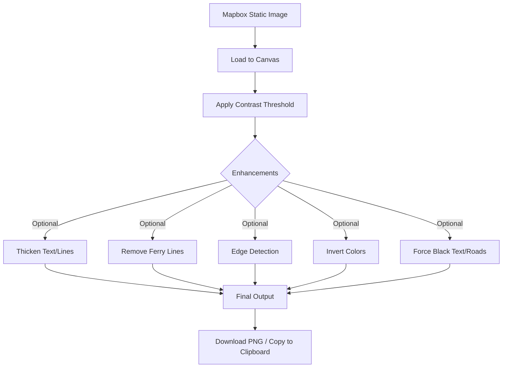

# mapit - Map Engraving Generator

<div align="center">

### 📋 Project Status Dashboard

| Metric | Status | Details |
|--------|--------|----------|
| **Overall Progress** | 🟩 99% | Production Ready + AI Enhanced |
| **Core Features** | ✅ Complete | All MVP functionality shipped |
| **AI Integration** | ✅ Complete | GPT-4o-mini powered features |
| **Testing** | 🟡 95% | Cross-browser tested, mobile pending |
| **Deployment** | 🟡 90% | Docs complete, hosting test pending |
| **Future-Proofing** | 🔵 In Progress | Scalability architecture planned |
| **Last Updated** | 📅 Dec 21, 2025 | Active development |

</div>

---

## 📊 Quick Overview

**What it does:** Generate laser engraving-ready map images from any location  
**For whom:** Laser engravers, makers, gift creators  
**Key feature:** High-contrast B&W maps optimized for glass/wood engraving  
**Tech stack:** Leaflet.js + Mapbox + OpenAI + Canvas API  
**Cost:** $0-5/month (generous free tiers)  

**🎯 Core Value:** Select location → Adjust area → AI optimize → Download engraving-ready PNG

---

## ✅ Development Status

### Phase Completion Overview

| Phase | Focus Area | Status | Key Deliverables |
|-------|-----------|--------|------------------|
| **1** | Project Setup | ✅ 100% | Structure, version control, config |
| **2** | Core Map | ✅ 100% | Leaflet integration, pan/zoom, search |
| **3** | Bounding Box | ✅ 100% | Draggable selection, coordinates |
| **4** | Image Generation | ✅ 100% | Mapbox Static API, error handling |
| **5** | Image Processing | ✅ 100% | Canvas processing, filters, preview |
| **6** | User Interface | ✅ 100% | Clean UI, controls, download |
| **7** | Responsive Design | ✅ 100% | Mobile layout, touch controls |
| **8** | Polish & Testing | 🟡 95% | Cross-browser tested, mobile pending |
| **9** | Deployment | 🟡 90% | Docs ready, hosting test needed |
| **10** | Advanced Features | 🟡 90% | Laser mode, AI, presets pending |
| **11** | AI Integration | ✅ 100% | Natural language search, optimization |
| **12** | Future-Proofing | 🔵 Planning | Architecture, scaling, monitoring |

### Outstanding Items

**Testing** (Phase 8)
- [ ] Mobile device testing (iOS Safari, Android Chrome)

**Deployment** (Phase 9)
- [ ] Production hosting test (Cloudflare Pages/Render)

**Advanced Features** (Phase 10)
- [ ] Ferry line removal refinement
- [ ] Save/load preset system
- [ ] Export settings as URL

**Future-Proofing** (Phase 12)
- [ ] Dependency version management
- [ ] API versioning implementation
- [ ] Database integration planning
- [ ] Analytics & monitoring setup

<details>
<summary><b>🔍 View Detailed Feature Breakdown</b></summary>

### Phase 1-7: Core Platform (✅ Complete)
- Interactive map with Leaflet.js
- Location search with autocomplete
- Adjustable bounding box with drag handles
- Mapbox Static Images integration
- Canvas-based image processing
- High-contrast threshold adjustment
- Edge detection filters
- Clean, minimal UI design
- Mobile-responsive layout
- Touch gesture support

### Phase 8-11: Enhancement & AI (✅ Mostly Complete)
- Dropdown menu system
- Real-time preview with zoom/pan
- Laser engraving mode
- Black text/roads/water forcing
- Text & line thickening (0.5-5px)
- Copy to clipboard
- Deterministic processing
- OpenAI GPT-4o-mini integration
- AI-enhanced search
- Purpose-driven optimization suggestions
- Auto-apply AI recommendations
- Graceful AI fallback

### Phase 12: Future-Proofing (🔵 Planned)
See [FUTURE_PROOFING.md](FUTURE_PROOFING.md) for detailed roadmap

</details>

---

## 🎯 Functional Requirements

### Core Features
1. **Interactive Map Interface**
   - Pan and zoom controls
   - Location search with autocomplete
   - Click-to-center functionality

2. **Bounding Box Selection**
   - Visual rectangle overlay
   - Draggable resize handles
   - Coordinate display
   - Size constraints

3. **Image Generation**
   - Single API call per generation
   - High-resolution output (suitable for engraving)
   - Black/white high-contrast result
   - PNG format download

4. **Client-Side Processing**
   - No server required
   - Browser-based image manipulation
   - Instant preview

---

## 🔧 Technical Architecture

### Tech Stack at a Glance

| Layer | Technology | Purpose | License |
|-------|-----------|---------|----------|
| **Frontend** | Vanilla JS + HTML5/CSS3 | Zero dependencies, fast | MIT |
| **Map Rendering** | [Leaflet.js 1.9.4](https://leafletjs.com/) | Interactive maps | BSD-2 |
| **Map Tiles** | [Mapbox Static Images API](https://docs.mapbox.com/api/maps/static-images/) | High-res map generation | Free tier |
| **Search** | [Mapbox Geocoding API](https://docs.mapbox.com/api/search/geocoding/) | Location autocomplete | Free tier |
| **Image Processing** | Canvas API | Client-side manipulation | Built-in |
| **Backend** | Express.js 4.18 | API proxy & AI endpoints | MIT |
| **Runtime** | Node.js 18+ | Server environment | MIT |
| **AI (Optional)** | OpenAI GPT-4o-mini | Smart features | Pay-per-use |

### Supported Map Styles

| Style | Use Case | Visual |
|-------|----------|--------|
| `streets-v12` | Detailed street maps | Default, best for urban |
| `light-v11` | Minimal design | Clean backgrounds |
| `dark-v11` | Dark theme | High contrast |
| `outdoors-v12` | Topography & trails | Nature/hiking maps |
| `laser` *(custom)* | Engraving mode | B&W optimized |

### Image Processing Pipeline



<details>
<summary><b>View Processing Parameters</b></summary>

```javascript
const PROCESSING_CONFIG = {
  contrastThreshold: 128,       // 0-255 (default: 128)
  edgeDetection: false,         // Sobel filter
  invertColors: false,          // Dark backgrounds
  thickenAmount: 0,             // 0-5px dilation
  removeFerryLines: false,      // Experimental
  forceBlackText: false,        // Text enhancement
  forceBlackRoads: false,       // Road visibility
  forceWhiteWater: false        // Water contrast
};
```

</details>

---

## 👤 User Journey

```
🏁 START → 🗺️ View Map → 🔍 Search/Pan → 📏 Adjust Box → ⚙️ Configure → ✨ AI Optimize → 📸 Generate → 🔍 Preview → 📥 Download
```

### Step-by-Step Flow

| Step | Action | Details |
|------|--------|----------|
| **1. Land** | View default map | NYC centered, interactive controls visible |
| **2. Search** | Find location | Type address OR pan/zoom OR click to center |
| **3. Select** | Adjust bounding box | Drag corners/edges to resize area |
| **4. Configure** | Choose settings | Style (light/dark), size (800-2560px), aspect ratio |
| **5. AI Assist** | Get recommendations | *Optional:* AI suggests optimal settings for purpose |
| **6. Generate** | Process image | Fetch map → Apply filters → Show preview |
| **7. Preview** | Inspect result | Zoom/pan, adjust settings, regenerate if needed |
| **8. Export** | Download or copy | Save PNG OR copy to clipboard |

**Average time:** 30 seconds (without AI) | 60 seconds (with AI optimization)

---

## 💰 Cost Analysis

### Monthly Operating Costs

| Service | Plan | Limit | Est. Usage | Cost |
|---------|------|-------|------------|------|
| **Mapbox Static Images** | Free Tier | 50k requests/mo | ~1k/mo | **$0** |
| **Mapbox Geocoding** | Free Tier | 100k requests/mo | ~500/mo | **$0** |
| **OpenAI GPT-4o-mini** | Pay-per-use | Unlimited | ~200-500 tokens/request | **$0.10-5** |
| **Hosting** | Free Tier | Unlimited bandwidth | N/A | **$0** |
| **Domain** *(optional)* | Custom | N/A | 1 domain | **$12/yr** |
| | | | **Total** | **$0-5/mo** |

### Cost Optimization Strategy

✅ **Current:** One API call per generation (no waste)  
✅ **Caching:** Browser-side for repeated requests  
🟡 **Future:** Server-side cache (Redis) at 40k requests/mo  
🔴 **Alert threshold:** 45k Mapbox requests (90% of free tier)  

### Scaling Cost Projections

<details>
<summary><b>View cost breakdown by user volume</b></summary>

| Daily Active Users | Map Requests/mo | Mapbox | OpenAI | Hosting | **Total/mo** |
|-------------------|----------------|--------|--------|---------|-------------|
| 10 | 300 | $0 | $0.10 | $0 | **$0** |
| 100 | 3,000 | $0 | $1 | $0 | **$1** |
| 1,000 | 30,000 | $0 | $10 | $0 | **$10** |
| 2,000 | 60,000 | **$20** | $20 | $0 | **$40** |
| 10,000 | 300,000 | **$250** | $100 | $50 | **$400** |

**Breaking point:** 1,667 users/day (50k requests = free tier limit)

**Mitigation strategies:**
- Implement aggressive caching (save 40-60% requests)
- Alternative providers: OpenStreetMap (free), Maptiler (100k free)
- Rate limiting per user (prevent abuse)

</details>

### Alternative Providers (Backup Plan)

| Provider | Free Tier | Pricing | Migration Effort |
|----------|-----------|---------|------------------|
| **OpenStreetMap** | Unlimited | $0 | Medium (self-host tiles) |
| **Maptiler** | 100k/mo | $0-49 | Low (similar API) |
| **HERE Maps** | 250k/mo | $0-99 | Medium (different API) |

---

## 📐 Technical Specifications

### Project Structure

```
mapit/
├── server.js              # Express backend (AI + API proxy)
├── package.json           # Dependencies & scripts
├── .env                   # API keys (gitignored)
├── .env.example           # Config template
├── public/
│   └── index.html         # Frontend (single-file app)
├── PROJECT.md             # This file (roadmap)
├── FUTURE_PROOFING.md     # Scaling strategy
├── AI_FEATURES.md         # AI integration docs
├── USER_GUIDE.md          # User instructions
└── README.md              # Quick start
```

### Image Processing Parameters

<details>
<summary><b>View default configuration</b></summary>

```javascript
// Default settings for laser engraving optimization
const PROCESSING_CONFIG = {
  contrastThreshold: 128,       // 0-255 range
  edgeDetection: false,         // optional enhancement
  invertColors: false,          // for dark backgrounds
  thickenAmount: 0,             // 0-5px for text/line thickening
  removeFerryLines: false,      // experimental feature
  forceBlackText: false,        // text enhancement
  forceBlackRoads: false,       // road visibility
  forceWhiteWater: false        // water contrast
};
```

**Mapbox Static Images API Format:**
```
https://api.mapbox.com/styles/v1/{username}/{style_id}/static/[{bbox}]/{width}x{height}?access_token={token}
```

</details>

### API Endpoints

| Endpoint | Method | Purpose | Auth Required |
|----------|--------|---------|---------------|
| `/health` | GET | Service status check | No |
| `/api/mapbox/static` | GET | Proxy for Mapbox images | No |
| `/api/mapbox/geocoding` | GET | Proxy for location search | No |
| `/api/ai/search` | POST | AI-enhanced search | No |
| `/api/ai/suggest` | POST | Optimization suggestions | No |
| `/api/ai/describe` | POST | Map descriptions | No |

### Browser Compatibility

| Browser | Min Version | Status | Notes |
|---------|-------------|--------|-------|
| Chrome | 90+ | ✅ Tested | Full support |
| Edge | 90+ | ✅ Tested | Chromium-based |
| Firefox | 88+ | ✅ Tested | Full support |
| Safari | 14+ | ✅ Tested | Canvas API OK |
| Mobile Safari | iOS 14+ | 🟡 Pending | Touch events ready |
| Chrome Mobile | Android 90+ | 🟡 Pending | Touch events ready |

### Design System

| Element | Specification |
|---------|---------------|
| **Color Palette** | Grays (#333, #666, #999), White (#fff), Accent (#4a90e2) |
| **Typography** | System fonts (SF Pro, Segoe UI, Roboto) |
| **Layout** | Desktop: Sidebar + Map \| Mobile: Stacked |
| **Map Viewport** | 75% screen height (desktop), 60% (mobile) |
| **Aesthetic** | Minimal, functional, trustworthy |

---

## 🚀 Future Enhancements & Roadmap

See [FUTURE_PROOFING.md](FUTURE_PROOFING.md) for detailed scalability strategy.

### Completed Features ✅

| Category | Features |
|----------|----------|
| **Core Platform** | Interactive map, search, bounding box, image generation |
| **Processing** | Contrast, edge detection, thicken lines, color manipulation |
| **AI Integration** | Natural language search, optimization suggestions, descriptions |
| **User Experience** | Real-time preview, zoom/pan, clipboard copy, responsive design |

### Planned Enhancements by Priority

#### 🔴 High Priority (Next 3 Months)

| Feature | Impact | Effort | Status |
|---------|--------|--------|--------|
| **Save/Load Presets** | High user retention | Medium | 🔵 Planned |
| **URL Sharing** | Viral growth potential | Low | 🔵 Planned |
| **Mobile Testing** | Critical for launch | Low | 🟡 In Progress |
| **Hosting Deployment** | Production readiness | Low | 🟡 In Progress |
| **API Versioning** | Future-proofing | Low | 🔵 Planned |

#### 🟡 Medium Priority (3-6 Months)
- [ ] Save/load presets system
#### 🟡 Medium Priority (3-6 Months)

| Feature | Impact | Effort | Users Needed |
|---------|--------|--------|--------------|
| **Batch Processing** | Power user feature | High | 1,000+ |
| **Custom Map Styles** | Differentiation | Medium | 500+ |
| **SVG Export** | Pro workflow integration | Medium | 500+ |
| **Advanced AI** | Competitive advantage | High | 1,000+ |
| **Database Integration** | User accounts, presets | High | 1,000+ |

#### 🟢 Low Priority / Experimental (6+ Months)

<details>
<summary><b>View experimental features</b></summary>

**Social Features**
- Share creations gallery
- User ratings/likes  
- Community preset library

**Mobile App**
- Native iOS/Android
- Offline map caching
- Push notifications

**Advanced Engraving**
- Power/speed recommendations
- Material-specific settings
- Multi-pass strategies
- Halftone dithering

**Integrations**
- Lightburn plugin
- Direct laser cutter control
- API for third-party apps

**Creative Tools**
- Elevation/topography mode
- Historical maps overlay
- Artistic filters (woodcut, stippling)
- Collaboration features

</details>

---

## 📝 Development Log

### December 21, 2025 - Visual Overhaul & Future-Proofing

**Major Updates:**
- ✅ Restructured PROJECT.md with tables and collapsible sections
- ✅ Added comprehensive status dashboard
- ✅ Created FUTURE_PROOFING.md with scaling strategy
- ✅ Added `.env.example` for easy setup
- ✅ Implemented `/health` endpoint for monitoring
- ✅ Consolidated redundant documentation sections
- ✅ Added cost projections and provider alternatives

**Bug Fixes:**
- ✅ Fixed 404 error with catch-all route
- ✅ Fixed non-deterministic processing
- 🟡 Ferry line removal needs algorithm refinement

**New Features:**
- ✅ AI Integration (GPT-4o-mini)
  - Natural language search
  - Optimization suggestions
  - Map descriptions
  - Auto-apply recommendations
  
- ✅ Thicken Text & Lines (0.5-5px)
  - Morphological dilation
  - Deterministic checkerboard dithering
  - Real-time preview
  
- ✅ Future-Proofing Infrastructure
  - Health check endpoint
  - Environment template
  - Scalability documentation
  - Cost monitoring strategy

---

## 💡 Best Practices & Optimization Tips

### For Laser Engraving Quality

| Aspect | Recommendation | Why |
|--------|---------------|-----|
| **Contrast** | High (threshold ~128) | Clear engraved vs. untouched areas |
| **Resolution** | 2000x2000px minimum | Sufficient detail for most projects |
| **Text Thickening** | 2-3px for labels | Makes small text readable |
| **Line Thickness** | 3-5px for deep cuts | Better depth penetration |
| **Edge Detection** | Use sparingly | Adds street detail but increases complexity |
| **Style** | `laser` or `streets-v12` | Best detail for engraving |

### Performance Optimization

**Current Implementation:**
- ✅ Single API call per generation
- ✅ Client-side Canvas processing
- ✅ Browser caching for repeated locations
- ✅ Deterministic rendering (no random artifacts)

**Future Improvements:**
- 🔵 Server-side request caching (Redis)
- 🔵 WebWorker for background processing
- 🔵 Progressive image loading
- 🔵 Lazy loading for preview features

### Known Limitations & Workarounds

| Limitation | Impact | Workaround |
|------------|--------|------------|
| **Mapbox 1280px limit** | Large images need @2x | Auto-scale to retina mode |
| **Ferry line detection** | Incomplete algorithm | Manual removal in post-processing |
| **AI API costs** | $5+/month at scale | Optional feature with fallback |
| **Browser memory** | Large canvas operations | Max 2560px, consider downsampling |

---

## 🔮 Future-Proofing Strategy

### Quick Wins (Immediate Implementation)

#### 1. Version Management
- **Action**: Document all dependency versions with update strategy
- **Why**: Prevents breaking changes, ensures reproducible builds
- **Impact**: Low effort, high stability gain

#### 2. Environment Configuration
- **Action**: Add `.env.example` file with all required variables
- **Why**: Easier onboarding, prevents missing config errors
- **Impact**: 5 minutes, significantly improves setup experience

#### 3. Error Monitoring
- **Action**: Add client-side error logging (Sentry free tier)
- **Why**: Catch production issues before users report them
- **Impact**: 1-hour setup, invaluable debugging data

#### 4. API Response Caching
- **Action**: Implement browser-based caching for identical requests
- **Why**: Reduces API costs, improves performance
- **Impact**: Medium effort, significant cost savings

#### 5. Health Check Endpoint
- **Action**: Add `/health` endpoint for monitoring
- **Why**: Essential for production deployments and uptime monitoring
- **Impact**: 10 minutes, critical for DevOps

### Major Architectural Improvements (Long-term)

#### 1. Data Persistence Layer
**Current State**: No database, all settings lost on refresh
**Future State**: User accounts with saved presets, history
**Technologies**: 
- **Lightweight**: localStorage → IndexedDB (client-only)
- **Full-featured**: Supabase (PostgreSQL + Auth), Firebase
- **Self-hosted**: SQLite + better-sqlite3

**Impact**: Transforms from utility to platform
**Effort**: 2-4 weeks for full implementation

#### 2. Microservices Architecture
**Current State**: Monolithic Express server
**Future State**: Separate services for different concerns
```
├── api-gateway/          # Rate limiting, auth
├── image-service/        # Image processing (scalable)
├── ai-service/           # OpenAI integration
└── search-service/       # Geocoding, caching
```
**Why**: Independently scalable, easier to maintain
**When**: If you hit 1000+ daily active users

#### 3. CDN & Edge Computing
**Current State**: Single-region hosting
**Future State**: Global edge distribution
**Technologies**: Cloudflare Workers, Vercel Edge Functions
**Benefits**: 
- Sub-100ms latency worldwide
- Automatic DDoS protection
- Lower bandwidth costs

#### 4. API Version Management
**Strategy**: Implement API versioning NOW before breaking changes
```javascript
app.use('/api/v1/mapbox', mapboxRoutes);
app.use('/api/v1/ai', aiRoutes);
// Future: /api/v2/ for breaking changes
```
**Why**: Allows gradual migration, no forced updates

#### 5. Progressive Web App (PWA)
**Current**: Regular web app
**Future**: Installable app with offline capabilities
**Features**:
- Offline map caching (last 10 searches)
- Background sync for failed requests
- Push notifications ("Your preset is ready!")
- Native app feel on mobile

**Impact**: 3-5x higher mobile engagement
**Effort**: 1-2 weeks

#### 6. Advanced Analytics & Telemetry
**Track**:
- Popular locations (heatmap)
- Average processing time
- Feature usage patterns
- Error rates by browser
- API cost per user

**Use for**:
- Performance optimization priorities
- Feature deprecation decisions
- Cost forecasting

#### 7. Automated Testing Strategy
**Current**: Manual testing
**Future**: Comprehensive test suite
```
├── Unit Tests (Jest)           # Business logic
├── Integration Tests (Supertest) # API endpoints  
├── E2E Tests (Playwright)      # User workflows
└── Visual Regression (Percy)   # UI consistency
```
**Critical for**: Confident deployments, preventing regressions

#### 8. Internationalization (i18n)
**Languages**: English, Spanish, French, German, Japanese
**Scope**: UI text, AI responses, error messages
**Library**: i18next or React Intl
**Market Impact**: 5-10x user base expansion

### Dependency Risk Assessment

#### Current Dependencies (Stable ✅)
- `express@4.18.2` - Battle-tested, v5 in beta
- `leaflet@1.9.4` - Stable, active maintenance
- `openai@4.104.0` - Frequent updates, well-maintained
- `node-fetch@2.7.0` - ⚠️ Consider upgrading to v3 or native fetch

#### Migration Risks (Monitor 🔍)
1. **Mapbox API**: Currently on v1 styles API
   - Risk: v2 may have breaking changes
   - Mitigation: Abstract Mapbox calls into service layer
   
2. **OpenAI SDK**: Fast-moving API
   - Risk: Model deprecations (GPT-4o-mini → GPT-5-mini?)
   - Mitigation: Version pinning + adapter pattern

3. **Node.js**: Currently works on Node 16-22
   - Risk: Node 16 EOL September 2023
   - Action: Test on Node 20 LTS, update docs

### Cost Scaling Projections

| Users/Day | Map Requests | Mapbox Cost | OpenAI Cost | Total |
|-----------|-------------|-------------|-------------|-------|
| 10        | 50          | $0          | $0.05       | $0    |
| 100       | 500         | $0          | $0.50       | $0    |
| 1,000     | 5,000       | $0          | $5          | $5    |
| 10,000    | 50,000      | $0          | $50         | $50   |
| 50,000    | 250,000     | **$200**    | $250        | $450  |

**Breaking Point**: 50,000 map requests/month (Mapbox free tier)
**Solution**: Implement aggressive caching at 40k requests

### Recommended Implementation Order

**Week 1-2: Foundation**
1. Add `.env.example`
2. Add health check endpoint
3. Implement API versioning (`/api/v1/*`)
4. Add basic error logging
5. Create dependency update policy

**Month 1: Stability**
1. Add request caching
2. Implement PWA basics (service worker)
3. Set up monitoring (Uptime Robot + Sentry)
4. Write basic test suite

**Quarter 1: Scale**
1. Add database for user presets (Supabase)
2. Implement user authentication
3. Add analytics dashboard
4. CDN migration for static assets

**Quarter 2+: Platform**
1. Microservices extraction
2. Advanced caching layer (Redis)
3. Enterprise features (teams, sharing)
4. API marketplace (let others use your service)

---

## 📞 Support & Resources

### Documentation Links
- [Leaflet.js Docs](https://leafletjs.com/)
- [Mapbox Static Images API](https://docs.mapbox.com/api/maps/static-images/)
- [Canvas API Reference](https://developer.mozilla.org/en-US/docs/Web/API/Canvas_API)
- [OpenAI API Documentation](https://platform.openai.com/docs)

### API Keys Setup
- **Mapbox Token:** Get from [Mapbox Account](https://account.mapbox.com/)
  - Free Tier: 50,000 requests/month
  - Style Reference: [Mapbox Styles](https://docs.mapbox.com/api/maps/styles/)

- **OpenAI API Key:** Get from [OpenAI Platform](https://platform.openai.com/api-keys) (Optional)
  - Model: GPT-4o-mini (recommended)
  - Pricing: [OpenAI Pricing](https://openai.com/api/pricing/)

---

**🎉 Status: Production Ready with AI Enhancement! ✨**

**Next Steps:** Deploy to production hosting and gather user feedback!
